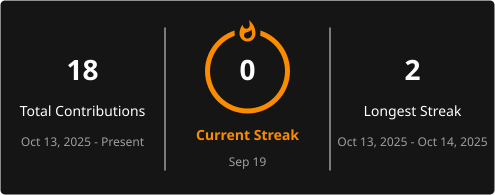

<h1 align="center">
  Hi there, I'm Vladyslav Lytovchenko 👋
</h1>

<h3 align="center">
  Senior Unity Developer • .NET Developer • Software Engineer
</h3>

<p align="center">
  🇵🇱 Warsaw, Poland
</p>

<p align="center">
  <a href="https://linkedin.com/in/vladyslav-lytovchenko">
    
  </a>
  &nbsp;
  <a href="mailto:litovchenko.vlad.unity@gmail.com">
    
  </a>
  &nbsp;
  <a href="https://playcheaper.com">
    
  </a>
</p>
```


---

## 👨‍💻 About Me

I'm a Software Engineer with **10+ years of commercial C# experience** and **10 years of professional Unity development**.

My background is primarily in **game development**, where I have worked on complex gameplay systems, architectures, performance optimization, multiplayer features, and large-scale Unity projects.

Currently, I'm expanding my expertise into **.NET backend and full-stack development**, focusing on scalable architectures, clean code, APIs, databases, and modern web technologies.

I enjoy working on complex systems, improving legacy codebases, and turning complicated problems into simple and maintainable solutions.

---

## 💻 .NET & Full-Stack Development

### Backend

<p>
  
  
  
  
  
</p>

### Databases

<p>
  
  
</p>

### Frontend

<p>
  
  
  
</p>

### Architecture & Engineering

<p>
  
  
  
  
</p>

---

## 🚀 Current Focus

- 🔨 **Building:** [PlayCheaper.com](https://playcheaper.com) — a game recommendation and price-tracking platform built with .NET, PostgreSQL and React.
- 🧠 **Learning:** System Design, algorithms, data structures and advanced backend development.
- 🤖 **Exploring:** Agentic AI and AI-assisted software development workflows.
- 🎮 **Creating:** Unity game development projects and gameplay systems.
- 🤝 **Open to:** Interesting .NET, Unity and open-source projects.

---

## 📊 GitHub Activity

<p align="center">
  
  
</p>

<p align="center">
  
</p>

## 🧰 Tools & Technologies

### 🎮 Game Development

<p align="center">
  
  
  
</p>

### 💻 Backend & Web

<p align="center">
  
  
  
  
</p>

### 🗄️ Infrastructure & Tools

<p align="center">
  
  
  
  
  
</p>

---

## 📫 Let's Connect

<p align="center">
  <a href="mailto:litovchenko.vlad.unity@gmail.com">
    
  </a>
  &nbsp;
  <a href="https://linkedin.com/in/vladyslav-lytovchenko">
    
  </a>
  &nbsp;
  <a href="https://playcheaper.com">
    
  </a>
</p>
```

